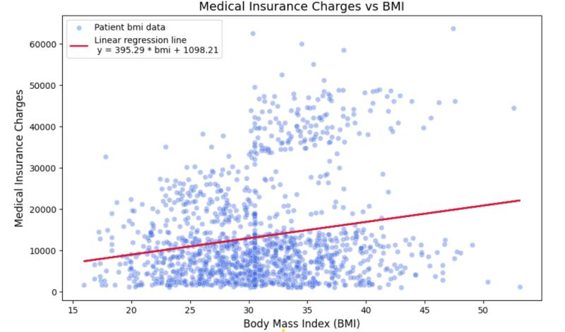

⚙**️Technology used**

- Python
- Pandas
- Scipy
- Seaborn
- Matplotlib

💬**Description**

This is a project took analysis of the insurance medical health data of patients. Which include Exploratory Data Analysis, Data cleaning and transformation, statistical inference and run a basic machine learning algorithm to predict the insurance finance charge on patient depending on their health status. 
For more description about the steps, the findings and the results, please take a look in the Jupyter Notebooks to find out more. 